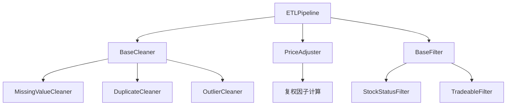

# ETL Pipeline 清洗层详解

本文档详细解析 `quant/data/etl/` 模块的设计与实现，重点关注 Pipeline 模式和数据转换。

## 1. 模块概述

ETL（Extract-Transform-Load）清洗层负责对原始数据进行标准化处理，包括：

- **缺失值处理**：填充或删除
- **去重处理**：移除重复记录
- **异常值处理**：缩尾、Z-score、删除
- **复权处理**：前复权/后复权
- **状态过滤**：排除 ST、停牌、退市股票

### 文件结构

```
quant/data/etl/
├── __init__.py          # 模块导出
├── base.py              # 抽象基类定义
├── cleaners.py          # 清洗器实现
├── adjust.py            # 复权处理器
├── filters.py           # 过滤器实现
└── pipeline.py          # Pipeline 编排器
```

### 核心组件关系



## 2. 抽象基类设计

### 2.1 BaseCleaner - 清洗器基类

```python
# quant/data/etl/base.py

from abc import ABC, abstractmethod
import pandas as pd

class BaseCleaner(ABC):
    """清洗器抽象基类

    所有清洗器都需要继承此类并实现 clean 方法。
    清洗器设计为无状态的（除了配置参数），便于复用和测试。
    """

    @property
    @abstractmethod
    def name(self) -> str:
        """清洗器名称，用于日志和调试"""
        ...

    @abstractmethod
    def clean(self, df: pd.DataFrame) -> pd.DataFrame:
        """执行清洗操作

        Args:
            df: 待清洗的 DataFrame

        Returns:
            清洗后的 DataFrame

        Note:
            - 不应修改原始 DataFrame（返回新对象）
            - 可以添加新列（如标记列）
            - 应记录清洗统计信息
        """
        ...
```

**设计要点**：

1. **抽象基类**：使用 `ABC` 定义接口规范
2. **无状态设计**：清洗器不保存数据，只保存配置
3. **不可变性**：`clean` 方法不应修改输入 DataFrame

### 2.2 BaseTransformer - 转换器基类

```python
class BaseTransformer(ABC):
    """数据转换器基类

    用于需要额外数据的转换操作（如复权需要复权因子）。
    与 Cleaner 不同，Transformer 可能需要外部数据。
    """

    @abstractmethod
    def transform(self, df: pd.DataFrame, **kwargs) -> pd.DataFrame:
        """执行转换操作

        Args:
            df: 待转换的 DataFrame
            **kwargs: 额外参数（如复权因子数据）
        """
        ...
```

### 2.3 BaseFilter - 过滤器基类

```python
class BaseFilter(ABC):
    """过滤器基类

    用于过滤不符合条件的记录。
    """

    @abstractmethod
    def filter(self, df: pd.DataFrame, **kwargs) -> pd.DataFrame:
        """执行过滤操作"""
        ...
```

### 2.4 CleaningStats - 统计信息

```python
class CleaningStats:
    """清洗统计信息

    记录清洗过程中的统计信息，用于日志和报告。
    """

    def __init__(self, cleaner_name: str):
        self.cleaner_name = cleaner_name
        self.input_rows = 0
        self.output_rows = 0
        self.removed_rows = 0
        self.modified_rows = 0
        self.details: dict = {}

    @property
    def removal_rate(self) -> float:
        """移除率"""
        if self.input_rows == 0:
            return 0.0
        return self.removed_rows / self.input_rows
```

## 3. 清洗器实现

### 3.1 MissingValueCleaner - 缺失值处理

```python
# quant/data/etl/cleaners.py

class MissingValueCleaner(BaseCleaner):
    """缺失值清洗器

    支持多种填充策略，按股票分组处理。
    """

    def __init__(
        self,
        strategy: Literal["ffill", "bfill", "drop", "fillna"] = "ffill",
        fill_value: float | int | str = 0,
        limit: int = 5,
        group_by: str = "ts_code",
        columns: list[str] | None = None,
    ):
        """
        Args:
            strategy: 填充策略
                - ffill: 前向填充（用前一个有效值填充）
                - bfill: 后向填充（用后一个有效值填充）
                - drop: 直接删除含缺失值的行
                - fillna: 用固定值填充
            fill_value: 当 strategy="fillna" 时使用的填充值
            limit: 填充的最大连续数（防止过度填充）
            group_by: 分组列名（按股票分组填充）
            columns: 需要处理的列，None 表示处理所有数值列
        """
        ...
```

**核心实现**：

```python
def clean(self, df: pd.DataFrame) -> pd.DataFrame:
    # 确定要处理的列
    if self.columns is None:
        numeric_cols = df.select_dtypes(include=[np.number]).columns.tolist()
        exclude_cols = {self.group_by, "trade_date", "ts_code"}
        cols_to_process = [c for c in numeric_cols if c not in exclude_cols]

    if self.strategy == "drop":
        df = df.dropna(subset=cols_to_process)

    elif self.strategy == "fillna":
        df[cols_to_process] = df[cols_to_process].fillna(self.fill_value)

    else:  # ffill 或 bfill，按股票分组处理
        if self.group_by in df.columns:
            df = df.sort_values([self.group_by, "trade_date"])
            if self.strategy == "ffill":
                df[cols_to_process] = (
                    df.groupby(self.group_by)[cols_to_process]
                    .ffill(limit=self.limit)
                )
```

**关键点**：
- **分组填充**：按股票代码分组，避免跨股票填充
- **限制填充**：`limit` 参数防止用很久之前的数据填充
- **排序保证**：填充前按日期排序

### 3.2 DuplicateCleaner - 去重处理

```python
class DuplicateCleaner(BaseCleaner):
    """去重清洗器

    按指定列组合去重，保留最后一条记录。
    """

    def __init__(
        self,
        subset: list[str] | None = None,
        keep: Literal["first", "last", False] = "last",
    ):
        """
        Args:
            subset: 用于判断重复的列，默认 ["ts_code", "trade_date"]
            keep: 保留策略
                - first: 保留第一条
                - last: 保留最后一条
                - False: 删除所有重复项
        """
        self.subset = subset or ["ts_code", "trade_date"]
        self.keep = keep
```

### 3.3 OutlierCleaner - 异常值处理

```python
class OutlierCleaner(BaseCleaner):
    """异常值清洗器

    支持多种异常值处理方法。
    """

    def __init__(
        self,
        method: Literal["winsorize", "zscore", "remove", "mark"] = "winsorize",
        columns: list[str] | None = None,
        limits: tuple[float, float] = (0.01, 0.99),
        zscore_threshold: float = 3.0,
        pct_chg_limit: float = 30.0,
    ):
        """
        Args:
            method: 处理方法
                - winsorize: 缩尾处理（将极端值替换为分位数边界值）
                - zscore: Z-score 方法（超过阈值的标记或替换）
                - remove: 直接删除异常行
                - mark: 标记异常但不处理（添加 is_outlier 列）
            limits: winsorize 的分位数边界，默认 (0.01, 0.99)
            zscore_threshold: zscore 方法的阈值
            pct_chg_limit: 涨跌幅异常阈值（%）
        """
```

**缩尾处理实现**：

```python
if self.method == "winsorize":
    lower, upper = self.limits
    lower_val = df[col].quantile(lower)  # 1% 分位数
    upper_val = df[col].quantile(upper)  # 99% 分位数

    # 将超出范围的值裁剪到边界
    df[col] = df[col].clip(lower=lower_val, upper=upper_val)
```

**Z-score 方法实现**：

```python
elif self.method == "zscore":
    col_mean = df[col].mean()
    col_std = df[col].std()
    if col_std > 0:
        z_scores = np.abs((df[col] - col_mean) / col_std)
        outlier_mask = z_scores > self.zscore_threshold
        # 用均值替换异常值
        df.loc[outlier_mask, col] = col_mean
```

## 4. Pipeline 编排器

### 4.1 ETLPipeline 类

```python
# quant/data/etl/pipeline.py

class ETLPipeline:
    """ETL 管道

    按顺序执行清洗、转换、过滤操作。
    支持链式调用配置。
    """

    def __init__(self):
        self.cleaners: list[BaseCleaner] = []
        self.adjuster: PriceAdjuster | None = None
        self.status_filter: StockStatusFilter | None = None
        self._stats: list[CleaningStats] = []
```

### 4.2 链式调用配置

```python
def add_cleaner(self, cleaner: BaseCleaner) -> "ETLPipeline":
    """添加清洗器（返回 self 支持链式调用）"""
    self.cleaners.append(cleaner)
    return self

def set_adjuster(self, method: Literal["qfq", "hfq", "none"] = "qfq") -> "ETLPipeline":
    """设置复权方式"""
    self.adjuster = PriceAdjuster(method=method)
    return self

def set_filter(self, stock_info: pd.DataFrame | None = None) -> "ETLPipeline":
    """设置过滤器"""
    self.status_filter = StockStatusFilter()
    if stock_info is not None:
        self.status_filter.update_status(stock_info)
    return self
```

**使用示例**：

```python
pipeline = (
    ETLPipeline()
    .add_cleaner(DuplicateCleaner())
    .add_cleaner(MissingValueCleaner(strategy="ffill", limit=5))
    .add_cleaner(OutlierCleaner(method="winsorize", limits=(0.01, 0.99)))
    .set_adjuster("qfq")
    .set_filter(stock_info=stock_df)
)
```

### 4.3 执行管道

```python
def run(
    self,
    df: pd.DataFrame,
    adj_factor: pd.DataFrame | None = None,
    exclude_st: bool = True,
    exclude_suspended: bool = True,
    exclude_delist: bool = True,
    min_turnover: float = 0.0,
) -> pd.DataFrame:
    """执行 ETL 管道

    执行顺序：
    1. 清洗器（按添加顺序）
    2. 复权处理
    3. 状态过滤
    """
    self._stats = []
    input_rows = len(df)

    # 1. 执行清洗器
    for cleaner in self.cleaners:
        df = cleaner.clean(df)
        stats = cleaner.get_stats()
        if stats is not None:
            self._stats.append(stats)

    # 2. 执行复权
    if self.adjuster is not None:
        df = self.adjuster.transform(df, adj_factor=adj_factor)

    # 3. 执行过滤
    if self.status_filter is not None:
        df = self.status_filter.filter(
            df,
            exclude_st=exclude_st,
            exclude_suspended=exclude_suspended,
            exclude_delist=exclude_delist,
            min_turnover=min_turnover,
        )

    return df
```

## 5. 工厂函数

### 5.1 默认管道

```python
def create_default_pipeline(
    adjust_method: Literal["qfq", "hfq", "none"] = "qfq",
    stock_info: pd.DataFrame | None = None,
) -> ETLPipeline:
    """创建默认 ETL 管道

    默认管道包含：
    1. 去重处理
    2. 缺失值填充（前向填充）
    3. 异常值处理（缩尾）
    4. 前复权
    5. 状态过滤（排除 ST/停牌/退市）
    """
    return (
        ETLPipeline()
        .add_cleaner(DuplicateCleaner())
        .add_cleaner(MissingValueCleaner(strategy="ffill", limit=5))
        .add_cleaner(OutlierCleaner(method="winsorize", limits=(0.01, 0.99)))
        .set_adjuster(adjust_method)
        .set_filter(stock_info=stock_info)
    )
```

### 5.2 最小管道

```python
def create_minimal_pipeline() -> ETLPipeline:
    """创建最小 ETL 管道

    只包含基本清洗：去重 + 缺失值处理
    用于调度器中的快速处理。
    """
    return (
        ETLPipeline()
        .add_cleaner(DuplicateCleaner())
        .add_cleaner(MissingValueCleaner(strategy="ffill", limit=5))
    )
```

### 5.3 严格管道

```python
def create_strict_pipeline(
    adjust_method: Literal["qfq", "hfq", "none"] = "qfq",
    stock_info: pd.DataFrame | None = None,
    min_turnover: float = 1.0,
) -> ETLPipeline:
    """创建严格 ETL 管道

    严格的清洗和过滤：
    - 异常值直接删除
    - 排除低换手率股票
    """
    return (
        ETLPipeline()
        .add_cleaner(DuplicateCleaner())
        .add_cleaner(MissingValueCleaner(strategy="drop"))  # 直接删除
        .add_cleaner(OutlierCleaner(method="remove"))  # 直接删除
        .set_adjuster(adjust_method)
        .set_filter(stock_info=stock_info)
    )
```

## 6. 设计模式总结

| 模式 | 应用 | 优势 |
|------|------|------|
| **策略模式** | 清洗器配置 | 运行时切换处理策略 |
| **责任链模式** | Pipeline 执行 | 灵活组合处理步骤 |
| **Builder 模式** | 链式调用 | 清晰的配置接口 |
| **模板方法** | 基类定义流程 | 统一的处理框架 |

## 7. 扩展指南

### 添加新的清洗器

```python
class MyCustomCleaner(BaseCleaner):
    @property
    def name(self) -> str:
        return "my_custom"

    def clean(self, df: pd.DataFrame) -> pd.DataFrame:
        self._stats = CleaningStats(self.name)
        self._stats.input_rows = len(df)

        # 实现清洗逻辑
        df = df[...]  # 你的处理

        self._stats.output_rows = len(df)
        return df

    def get_stats(self) -> CleaningStats | None:
        return self._stats
```

### 使用自定义清洗器

```python
pipeline = (
    ETLPipeline()
    .add_cleaner(DuplicateCleaner())
    .add_cleaner(MyCustomCleaner())  # 添加自定义清洗器
    .set_adjuster("qfq")
)
```

## 8. 最佳实践

1. **选择合适的管道**：
   - 数据初始化：使用 `create_default_pipeline`
   - 日常更新：使用 `create_minimal_pipeline`
   - 回测数据：使用 `create_strict_pipeline`

2. **注意执行顺序**：
   - 先去重，再处理缺失值
   - 先清洗，再复权
   - 最后过滤

3. **检查统计信息**：
   ```python
   result = pipeline.run(df)
   stats = pipeline.get_stats()
   for s in stats:
       print(f"{s.cleaner_name}: 移除 {s.removed_rows} 行")
   ```
